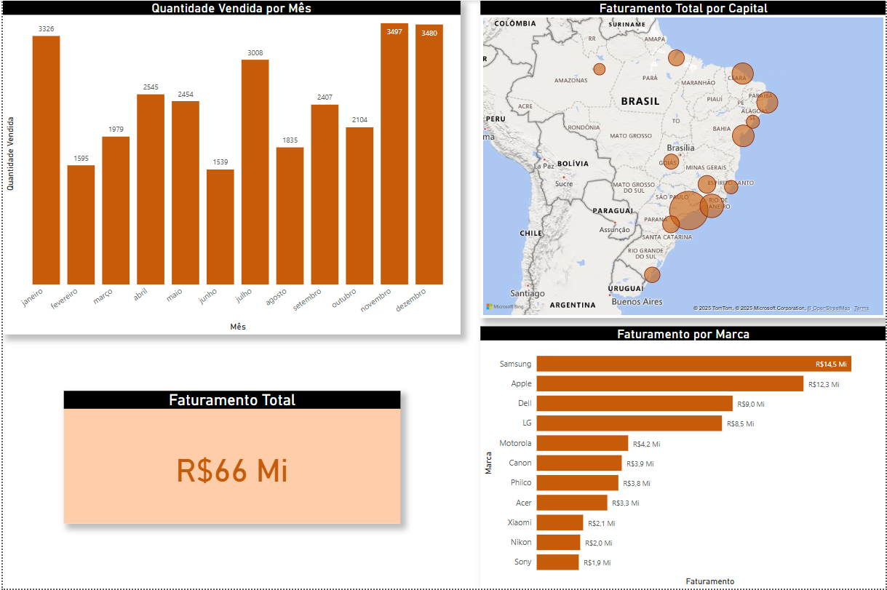

# Dashboard Power BI 📊

Desenvolvi um dashboard no Power BI a partir de uma planilha do Excel, destacando gráficos que ilustram o **Faturamento Total, o Faturamento Segmentado por Marcas, o Faturamento Total por Capital e a Quantidade Vendida Mensalmente.** Essa abordagem permite uma visualização clara e concisa dos dados, facilitando a tomada de decisões estratégicas. A interatividade do Power BI transforma a análise de vendas em uma experiência dinâmica e informativa

# Como Funciona 📌

No dashboard do Power BI, cada gráfico oferece interatividade para uma análise aprofundada dos dados. Ao passar o mouse ou clicar em um gráfico, como o de Faturamento Total, os dados relevantes se destacam, permitindo uma visualização focada. Por exemplo, ao selecionar o gráfico de Faturamento Total por Capital, um mapa do Brasil é exibido, mostrando o faturamento total de cada loja em cada estado. Essa funcionalidade proporciona uma compreensão mais clara das variações regionais nas vendas.  
Além disso, a interatividade entre os gráficos permite que os usuários explorem diferentes dimensões dos dados de forma intuitiva, facilitando a identificação de tendências e oportunidades. Essa dinâmica torna a análise de desempenho de vendas mais eficiente e informativa.

# Tecnologias  💻
As seguintes ferramentas que foram utilizadas na construção do projeto:
<table>
  <thead>
    <tbody>
    <td> <b>Microsoft Excel:</b> Utilizado como a fonte de dados, permitindo a organização e manipulação eficiente das informações antes de serem importadas para o Power BI.</td>
  </thead>
    <thead>
      <td> <b>Power BI:</b> Plataforma de visualização de dados que transforma informações em dashboards interativos, facilitando a análise e a apresentação de dados complexos de forma acessível. </td>
    </thead>
    <thead>
      <td> <b>DAX (Data Analysis Expressions):</b> Linguagem de formulação utilizada no Power BI para criar cálculos e medidas personalizadas, permitindo análises mais profundas e insights detalhados.</td>
    <thead>
      <td> <b>Geolocalização:</b> Recurso utilizado para representar dados em mapas, como o Faturamento Total por Capital, oferecendo uma visualização clara das variações regionais nas vendas.</td>
    </thead>
    <thead>
      <td> <b>Drill-Down:</b> Técnica que permite aprofundar a análise, possibilitando que o usuário clique em um gráfico para visualizar dados mais detalhados, como subdivisões por categorias ou períodos específicos, enriquecendo a compreensão dos dados.</td>
    </thead>
  </tbody>
</table>
